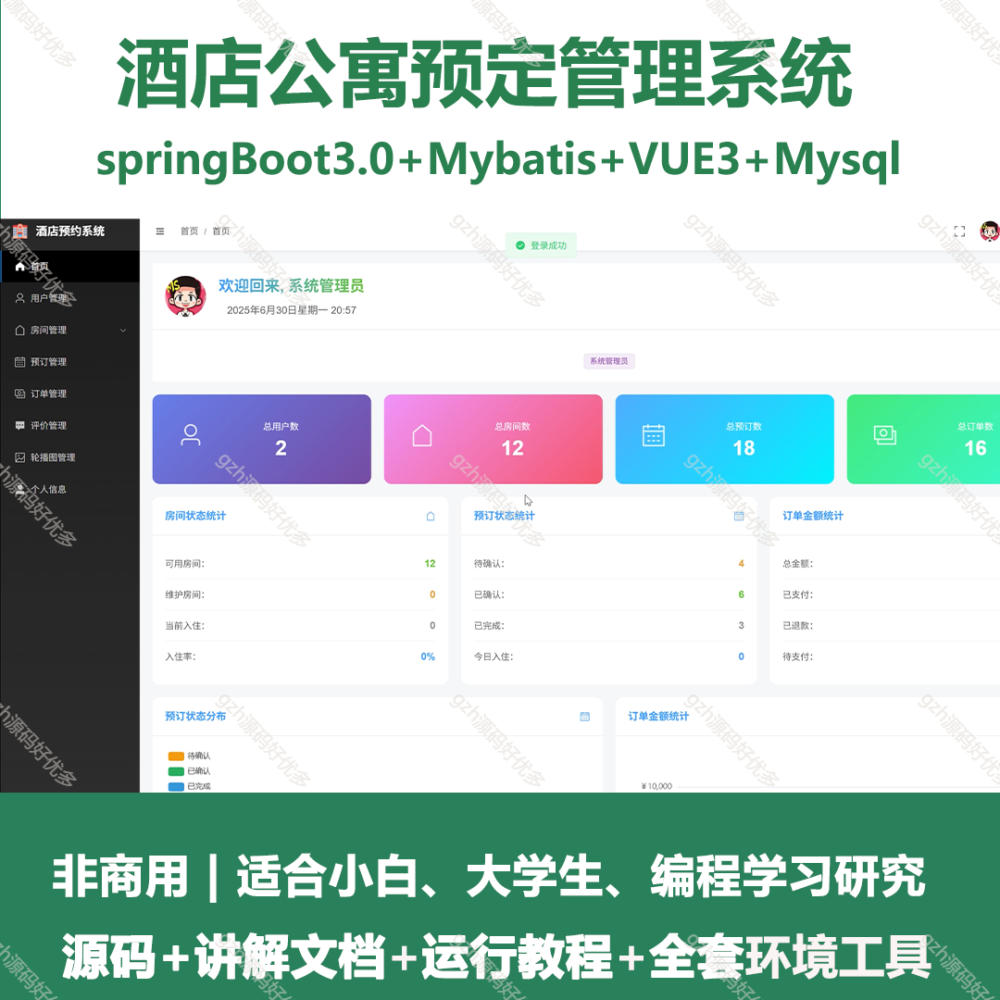
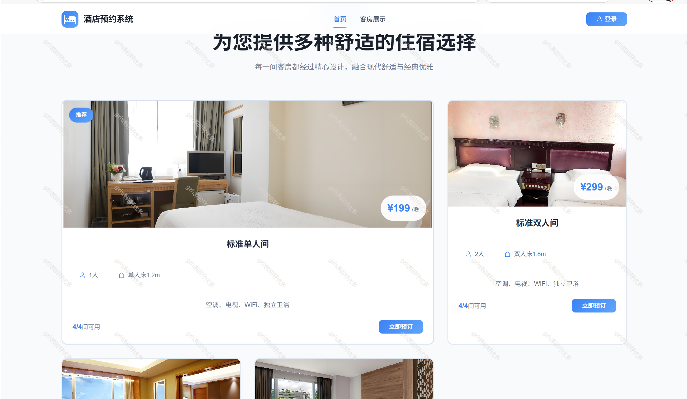
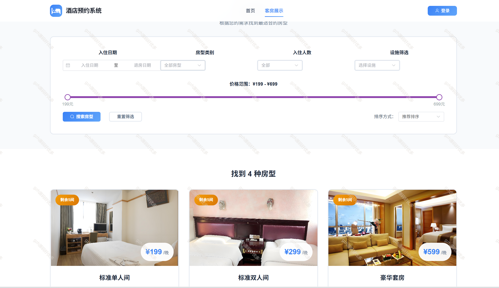
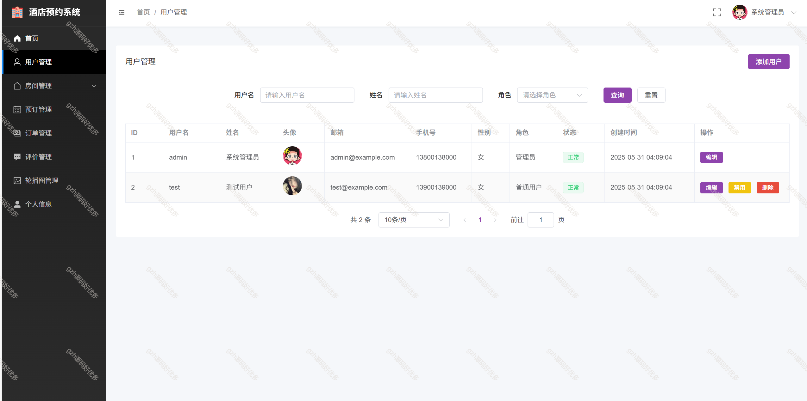
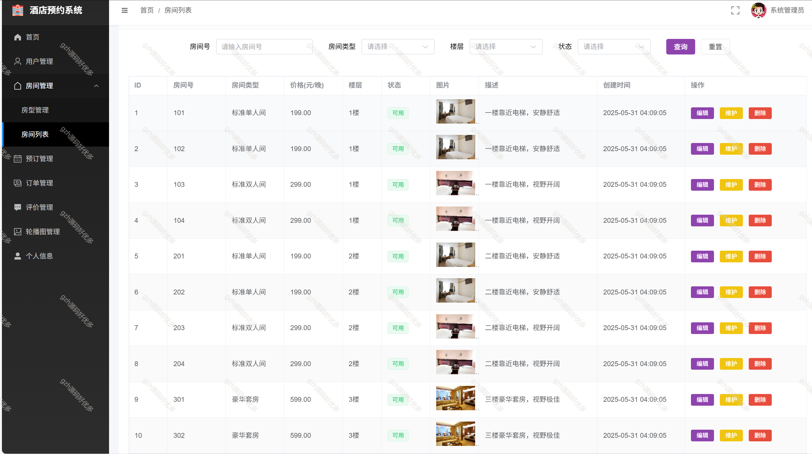
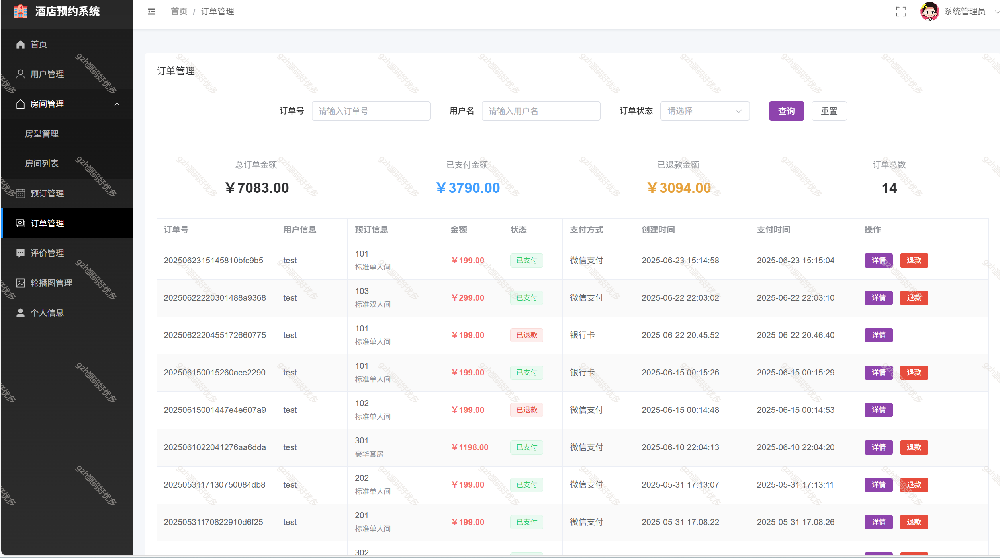
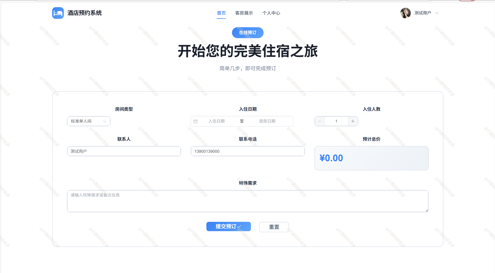
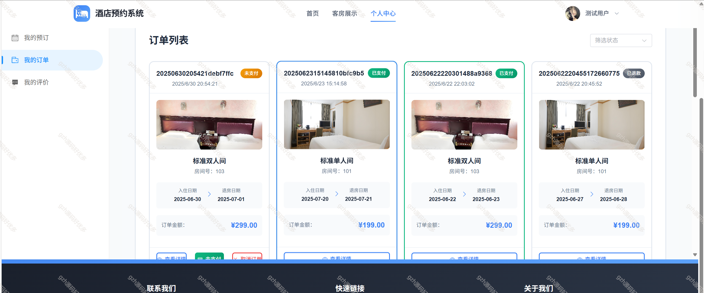
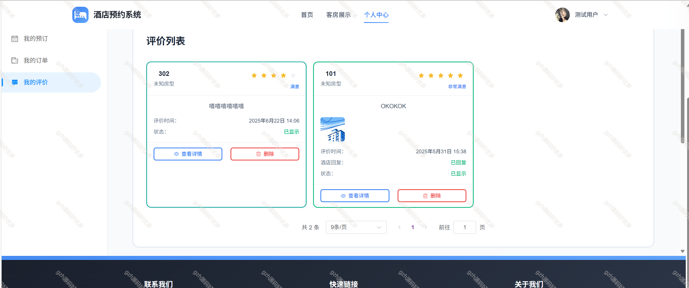

 
## 查看主页获取源码

### 一、关键词

酒店预定系统，公寓预定系统，宾馆预定管理系统

 

### 二、作品包含

源码+数据库+讲解文档+全套环境和工具资源+部署教程

 

### 三、项目技术

前端技术： vue3 Element Plus Axios Echarts
后端技术：Java、SpringBoot3.0、MyBatis

  

 

### 四、运行环境（以下版本亲测，其他版本未知，请自测）

开发工具：IDEA/eclipse  + VSCODE

数据库：MySQL8

数据库管理工具：Navicat10以上版本

环境配置软件： JDK17 + Maven3.6.3

前端Nodejs：16

浏览器：谷歌浏览器

 

### 五、项目介绍

项目编号：springbootA507

酒店宾馆公寓管理系统是一个基于SpringBoot+Vue3
系统功能需求
3.1 功能需求概述
本系统主要面向两类用户：普通用户（酒店客户）和管理员（酒店工作人员）。系统需要满足不同用户角色的不同需求，包括但不限于：预约管理、房间管理、用户管理、评价管理等功能。

3.2 用户角色定义
3.2.1 普通用户（USER）
普通用户是系统的主要服务对象，即有酒店预约需求的客户。其主要功能需求包括：

浏览酒店房间信息
进行酒店预约
查看和管理个人预约
在线支付
提交评价
查看个人信息并修改
3.2.2 管理员（ADMIN）
管理员是酒店的工作人员，负责系统的日常管理与维护。其主要功能需求包括：

管理用户信息
管理房间信息
处理预约请求
管理评价信息
查看统计数据
系统设置管理
3.3 详细功能需求
3.3.1 用户模块功能
用户注册

用户填写基本信息（用户名、密码、手机号等）进行注册
系统验证信息合法性
创建用户账号
用户登录

用户输入用户名和密码
系统验证身份
生成JWT令牌并返回给用户
个人信息管理

查看个人信息
修改个人信息（如手机号、邮箱等）
修改密码

3.3.2 房间管理模块功能
房型管理
添加房型
修改房型信息
删除房型
房间管理
添加房间
修改房间信息
删除房间
设置房间状态（可用、维护中等）
房间查询
按条件查询房间（如房型、价格区间、日期等）
查看房间详情
查看房间图片
3.3.3 预约管理模块功能
延长入住时间
3.3.4 评价管理模块功能
3.3.5 支付模块功能
3.3.7 轮播图管理模块功能

 

### 六、运行截图

